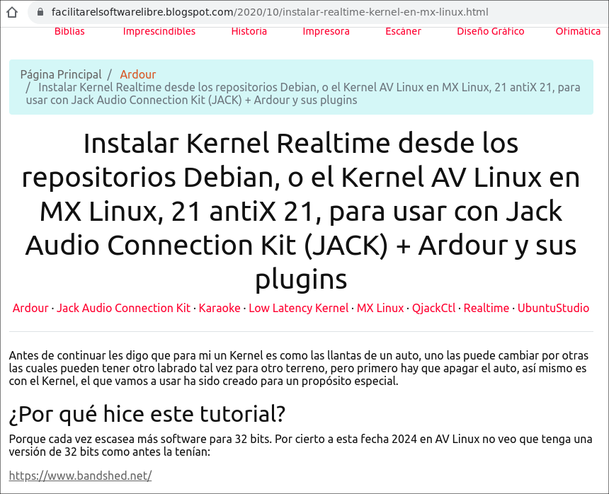
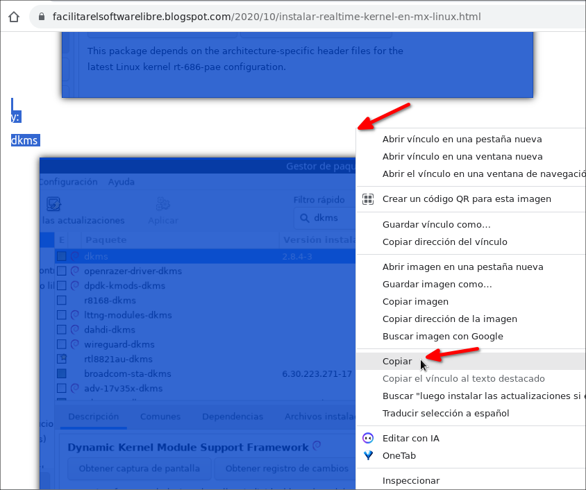
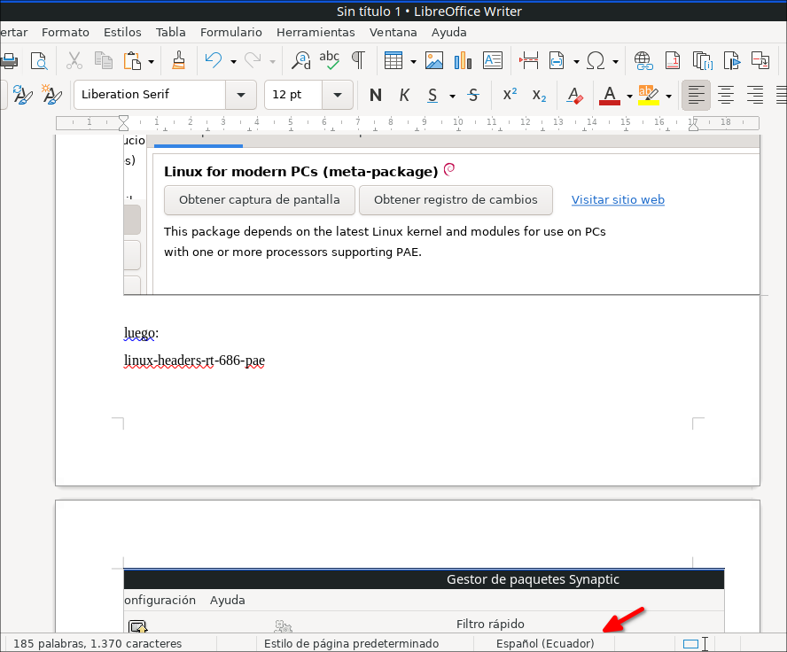
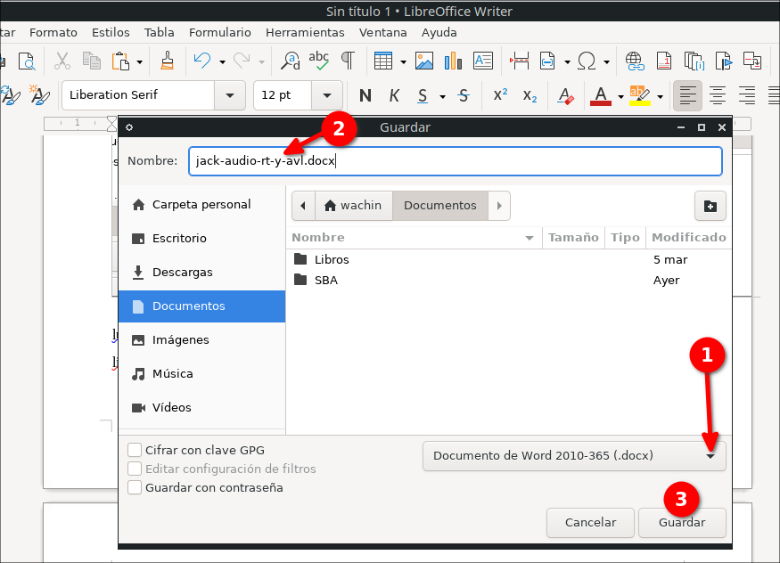
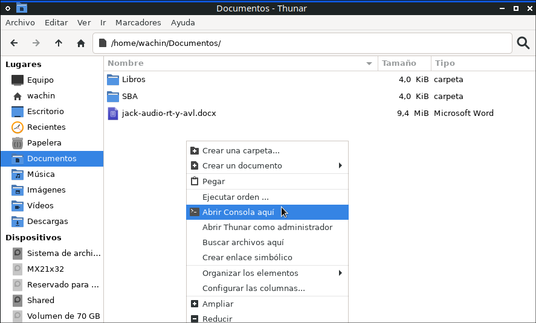
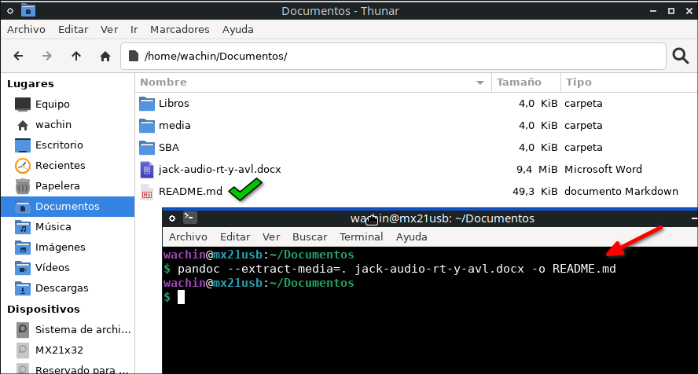
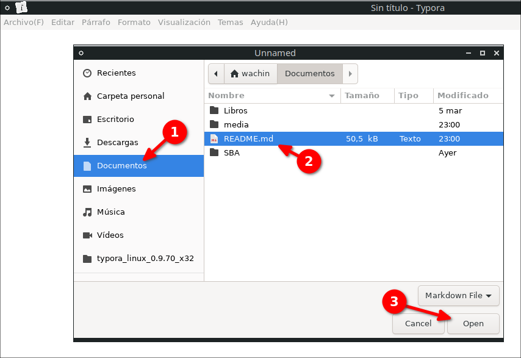
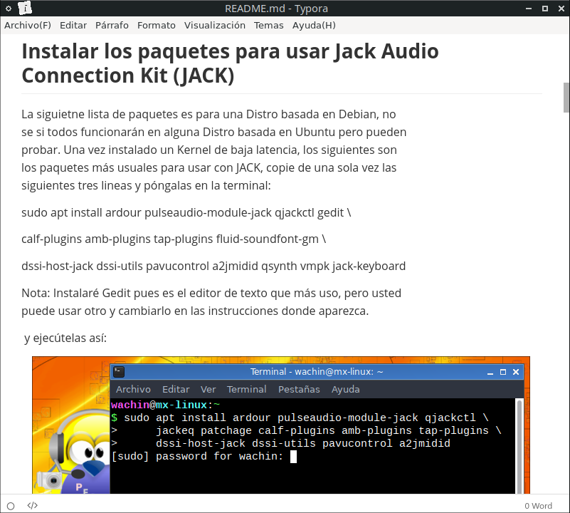
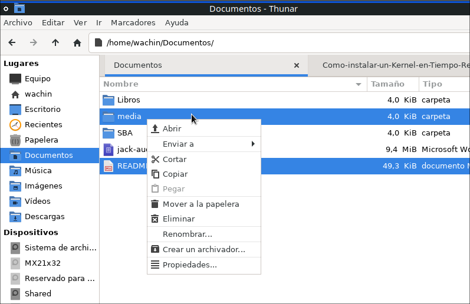
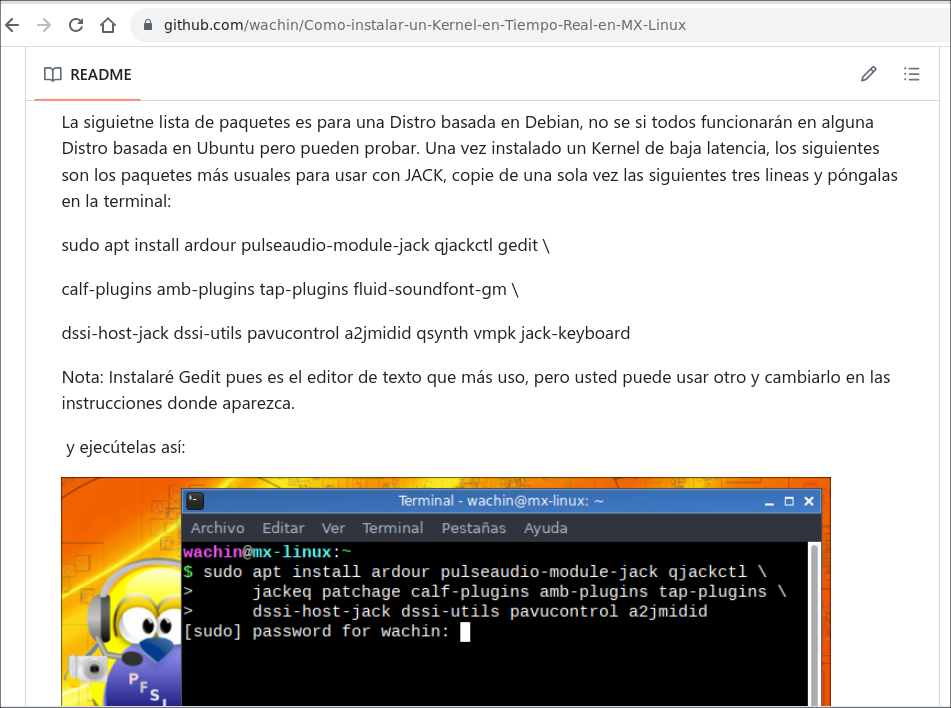

Convertir texto de una página web con imágenes a markdown .md incluidas las imágenes, con pandoc en Linux
=========================================================================================================

Como requerimiento usaremos LibreOffice y necesitamos tener instalado a
pandoc, así:

> sudo apt install pandoc

**Nota**: LibreOffice debería estar instalado por defecto. Aunque puede
ser que también se pueda usar WPS Office pero no lo he hecho, ustedes lo
pueden intentar si desean.

Ahora bien, tengo el texto con imágenes de la siguiente entrada en
Blogger:

[[https://facilitarelsoftwarelibre.blogspot.com/2020/10/instalar-realtime-kernel-en-mx-linux.html]{.underline}](https://facilitarelsoftwarelibre.blogspot.com/2020/10/instalar-realtime-kernel-en-mx-linux.html)

{width="8.958333333333334in"
height="7.270833333333333in"}

primero debo seleccionar todo el texto con las imágenes y copie:

{width="8.791666666666666in"
height="7.354166666666667in"}

ahora peguelo en LibreOffice:

{width="9.25in"
height="7.666666666666667in"}

y guarde el documento como docx:

{width="9.114583333333334in"
height="6.583333333333333in"}

y abra una terminal en la carpeta donde guardó el archivo, que yo le
puse como nombre:

jack-audio-rt-y-avl.docx

{width="9.239583333333334in"
height="5.572916666666667in"}

 y ponga el siguiente comando:

> pandoc \--extract-media=. jack-audio-rt-y-avl.docx -o README.md

así:

{width="9.25in"
height="4.958333333333333in"}

pero por cierto, usted deberá usar el nombre de su archivo, el mío lo
tengo sin espacios, pero si el nombre de su archivo tuviera espacios
ejemplo: 

mi nombre de archivo.docx

usted deberá escribir en la terminal así:

\"mi nombre de archivo.docx\"

y el comando sería así:

pandoc \--extract-media=. \"mi nombre de archivo.docx\" -o README.md

y con el archivo de salida, yo le puse de nombre README.md pero usted le
puede poner otro, y si le quiere poner varias palabras y con espacios
entre ellas ejemplo:

archivo de salida.md

usted deberá escribirlo así:

\"archivo de salida.md\"

Ahora abra el archivo de salida con ejemplo [Typora Linux]{.underline}:

{width="8.895833333333334in"
height="6.114583333333333in"}

y como vemos el archivo markdown contiene las imagenes que estaban en el
blog (html):

{width="8.34375in" height="7.5in"}

ahora, sabía que el archivo creado y la carpeta se pueden poner en
github para crear un README:

{width="8.302083333333334in"
height="5.375in"}

lo cual es justo lo que he hecho:

{width="9.90625in" height="7.375in"}

mi archivo markdown contiene en github todas las imagenes que tenía en
blogger:

[[https://github.com/wachin/Como-instalar-un-Kernel-en-Tiempo-Real-en-MX-Linux]{.underline}](https://github.com/wachin/Como-instalar-un-Kernel-en-Tiempo-Real-en-MX-Linux)

revisen y me dicen

### CONSULTAS

**Pandoc convert docx to markdown with embedded images**

[[https://stackoverflow.com/questions/39956497/pandoc-convert-docx-to-markdown-with-embedded-images]{.underline}](https://stackoverflow.com/questions/39956497/pandoc-convert-docx-to-markdown-with-embedded-images)

[[https://stackoverflow.com/a/52593892/10648253]{.underline}](https://stackoverflow.com/a/52593892/10648253)
